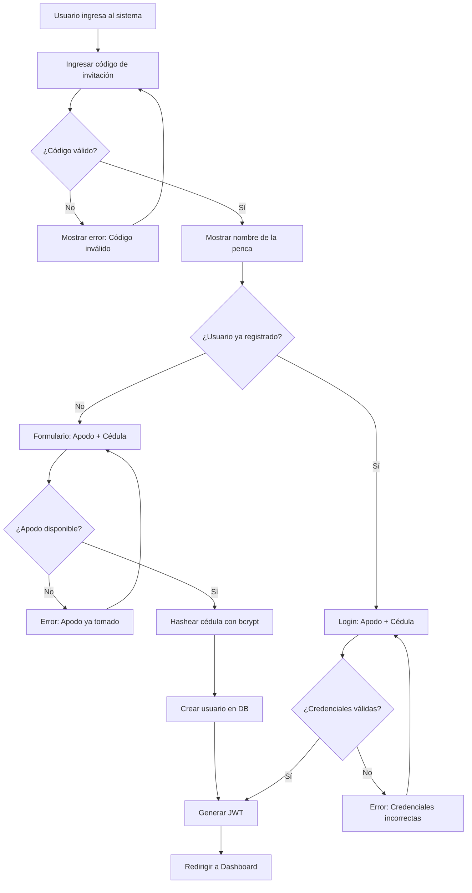
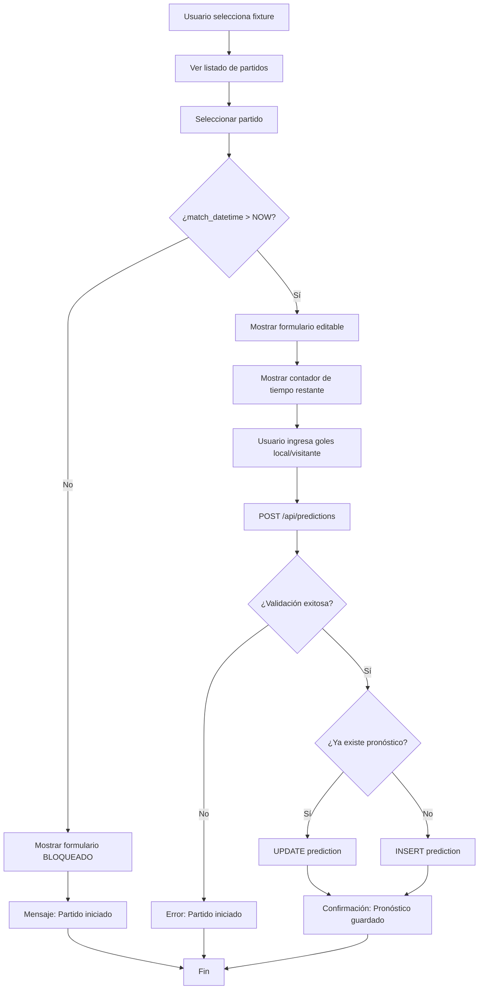
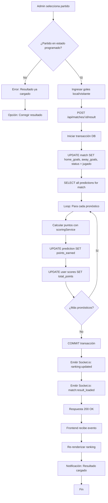
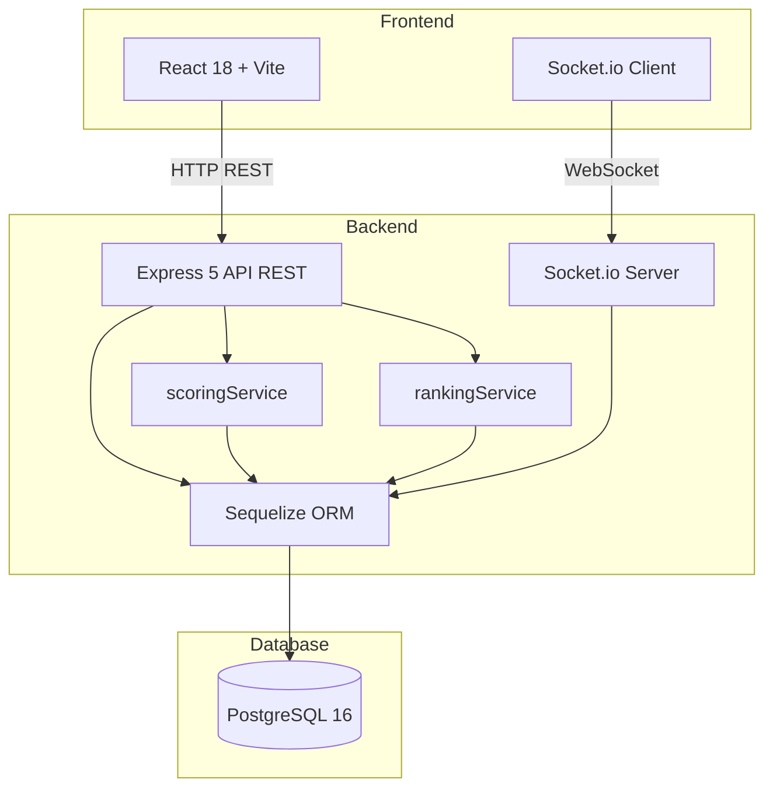

# PRD: ⚽ Fopapenka — Sistema Multi-Penca de Pronósticos de Fútbol

**Versión:** 1.5 MVP  
**Fecha:** Junio 2026  
**Proyecto:** Fopapenka

---

## 1. Visión

Este MVP implementa un sistema multi-penca de pronósticos deportivos centrado en la **integridad del sistema de puntuación**, el **aislamiento total entre pencas independientes** y el **bloqueo automático de pronósticos por tiempo**. Cada penca opera como una entidad completamente autónoma con su propio ranking, torneos, fixtures, chat y usuarios.

El sistema prioriza:
- **Cálculo correcto de puntos** en tiempo real tras cargar resultados (marcador exacto = 3 pts, resultado correcto = 1 pt).
- **Bloqueo automático de pronósticos** cuando el partido alcanza su hora de inicio configurada.
- **Atomicidad en operaciones críticas**: carga de resultados, recálculo de rankings y prevención de modificaciones concurrentes.
- **Acceso mediante código de invitación** único por penca + autenticación con cédula (hasheada).

El frontend (React + Socket.io) expone un flujo de: registro → pronóstico con validación de tiempo → visualización de ranking en tiempo real → chat comunitario. No se incluye sistema de pagos ni apuestas reales; el MVP está diseñado para uso social entre amigos.

---

## 2. Alcance (IN/OUT)

### 2.1 Objetivos de negocio

- **REQ-001**: Garantizar integridad del sistema de puntuación con cálculo automático tras carga de resultados (0 errores de puntuación en MVP).
- **REQ-002**: Prevenir pronósticos fuera de tiempo mediante bloqueo automático al inicio de cada partido.
- **REQ-003**: Mantener aislamiento total entre pencas (usuario A en penca X no ve datos de penca Y).
- **REQ-004**: Reducir spam de registros mediante código de invitación único por penca.
- **REQ-005**: Incrementar engagement comunitario con chat en tiempo real y ranking actualizado automáticamente.

### 2.2 Objetivos de usuario

- **REQ-006**: Permitir al jugador pronosticar resultados con tiempo límite claro (fecha/hora de inicio de cada partido).
- **REQ-007**: Ofrecer transparencia total del ranking con actualización automática post-resultado.
- **REQ-008**: Facilitar interacción entre participantes mediante chat general de la penca.
- **REQ-009**: Permitir al admin gestionar torneos, fixtures, equipos y resultados desde un panel centralizado.
- **REQ-010**: Garantizar al admin control sobre corrección de resultados con recálculo automático de puntos.

### 2.3 Dentro del alcance (IN)

#### Gestión de Pencas
- Creación de penca con código de invitación único.
- Configuración multi-penca: cada penca es independiente.
- Sistema de roles: Admin (creador) y Jugador.

#### Autenticación y Registro
- Registro mediante código de invitación + apodo + cédula (hasheada con bcrypt).
- Login con código + apodo + cédula.
- JWT con payload `{ userId, pencaId, role }`.
- Sin email requerido.

#### Gestión de Torneos
- Crear torneo con modo acumulativo o reinicio de ranking.
- Solo un torneo activo por penca a la vez.
- Finalizar torneo con validación de fixtures completas.

#### Gestión de Equipos y Fixtures
- Carga de equipos con nombre y escudo opcional.
- Creación de fixtures (fechas) con partidos asignados.
- **[NUEVA]** Configuración de fecha y hora específica por partido.
- Estados de partido: `programado` → `jugado`.

#### Sistema de Pronósticos
- **[CORE]** Bloqueo automático de pronósticos al alcanzar hora de inicio del partido.
- Edición de pronóstico hasta hora de inicio.
- Validación: solo partidos en estado `programado` y con tiempo disponible.
- Puntuación automática tras carga de resultado:
  - **Marcador exacto**: 3 puntos.
  - **Resultado correcto (ganador/empate)**: 1 punto.
  - **Sin acierto**: 0 puntos.

#### Carga de Resultados
- Carga manual por admin (goles local/visitante).
- Recálculo automático de puntos de todos los pronósticos del partido.
- Actualización inmediata de ranking.
- Corrección de resultados con recálculo completo.
- Log de auditoría de correcciones.

#### Ranking
- Ranking del torneo actual en tiempo real.
- Ranking histórico acumulado (si el torneo es acumulativo).
- Filtro por fixture.
- Resalte visual de posición propia.

#### Chat General
- Chat en tiempo real (Socket.io).
- Persistencia de mensajes.
- Carga de historial (últimos 50 mensajes).
- Solo usuarios autenticados de la misma penca.
- Máximo 500 caracteres por mensaje.

#### Visualización de Pronósticos
- Ver propios pronósticos en cualquier momento.
- Ver pronósticos de otros **solo después** de carga de resultado.
- Tabla comparativa post-partido.

### 2.4 Fuera de alcance (OUT)

- Sistema de pagos o apuestas reales.
- Integración con APIs de resultados en vivo (resultados cargados manualmente).
- Notificaciones push o email.
- Recuperación de contraseña (cédula).
- Eliminación de cuentas de usuarios.
- Estadísticas avanzadas por usuario (% aciertos, rachas, etc.).
- Sistema de recompensas o premios automatizados.
- Panel de administración multi-penca global.
- Multidivisa o internacionalización.

---

## 3. Usuarios y roles

### 3.1 Usuarios

- **Jugador**: Persona que se une a una penca con código de invitación, pronostica resultados, consulta ranking y participa en el chat.
- **Administrador de Penca**: Creador de la penca que gestiona torneos, equipos, fixtures, carga resultados y modera usuarios.

### 3.2 Roles & Permissions

#### Jugador (rol: `player`)
- ✅ Pronosticar partidos (antes de hora de inicio).
- ✅ Ver propios pronósticos.
- ✅ Ver pronósticos ajenos (post-resultado).
- ✅ Consultar ranking (torneo actual e histórico).
- ✅ Participar en chat general de la penca.
- ✅ Ver calendario completo de fixtures.
- ❌ Crear torneos, fixtures o cargar resultados.
- ❌ Gestionar usuarios.

#### Administrador (rol: `admin`)
- ✅ Todas las capacidades de Jugador.
- ✅ Crear y finalizar torneos.
- ✅ Cargar y editar equipos.
- ✅ Crear fixtures y asignar partidos con fecha/hora.
- ✅ Cargar y corregir resultados.
- ✅ Ver lista de usuarios registrados.
- ✅ Desactivar cuentas de jugadores.
- ✅ Ver código de invitación de la penca.

---

## 4. Requerimientos Funcionales

### 4.1 Gestión de Pencas

#### FUNC-001: Crear nueva penca con código único
**Prioridad**: P0  
**Vinculado a**: REQ-004, US-21

**Proceso completo de creación**:
1. Admin ingresa nombre de la penca.
2. Admin puede:
   - **Opción A**: Generar código automático (sistema crea código alfanumérico 6-8 caracteres).
   - **Opción B**: Personalizar código (validando disponibilidad).
3. Sistema valida unicidad del código globalmente.
4. Si código ya existe: error "Código no disponible, elige otro".
5. Sistema crea penca en estado `activa`.
6. Usuario creador se marca automáticamente como `admin` de esa penca.
7. Se muestra código de invitación claramente para compartir.

**Reglas del código de invitación**:
- Único globalmente en el sistema.
- Formato: 6-8 caracteres alfanuméricos (ej. `AMIGOS26`, `ABC123XY`).
- Insensible a mayúsculas/minúsculas para ingreso.
- Visible permanentemente en panel de admin.
- No reutilizable aunque la penca se desactive.

**Criterios de aceptación**:
- Código generado automáticamente es único (validación en DB antes de crear).
- Código personalizado valida unicidad antes de aceptar.
- Admin puede copiar código con un clic.
- Mensaje de confirmación: "Penca '{nombre}' creada. Código: {código}".
- Primer usuario de la penca obtiene rol `admin` automáticamente.

---

#### FUNC-002: Regenerar código de invitación
**Prioridad**: P1  
**Vinculado a**: REQ-004, US-22

**Escenario de uso**: El admin necesita invalidar el código actual si fue compartido por error o filtrado públicamente.

**Proceso**:
1. Admin accede a configuración de la penca.
2. Selecciona "Regenerar código de invitación".
3. Sistema muestra advertencia: "El código actual dejará de funcionar. Los usuarios ya registrados NO se verán afectados".
4. Admin confirma.
5. Sistema:
   - Genera nuevo código único.
   - Invalida código anterior (campo `old_invitation_codes` opcional en tabla `pencas`).
   - Registra cambio en `audit_log`.
6. Muestra nuevo código para compartir.

**Criterios de aceptación**:
- Código anterior deja de permitir nuevos registros inmediatamente.
- Usuarios ya registrados con código anterior mantienen acceso.
- Diálogo de confirmación obligatorio antes de regenerar.
- Nuevo código cumple mismas reglas de unicidad que FUNC-001.
- Log de auditoría registra: admin_id, old_code, new_code, timestamp.

**Estado de implementación**: ✅ Completado (v1.5)
- Backend: `GET /api/pencas/invite-code` (protegido con `isAdmin`).
- Frontend: Código visible en tab "Jugadores" del panel admin, con botón "📋 Copiar" (copia al portapapeles) y botón "🔄 Regenerar código" con diálogo de confirmación.
- Tests unitarios: 3 tests en `backend/test/penca.invite-code.test.js`.
- BDD: `tests/features/admin/invite_code.feature` (5 escenarios).

---

#### FUNC-003: Aislamiento total entre pencas
**Prioridad**: P0  
**Vinculado a**: REQ-003

Cada penca debe operar como entidad independiente con su propio:
- Conjunto de torneos.
- Equipo de usuarios.
- Ranking exclusivo.
- Chat privado.
- Fixtures y partidos.

**Criterios de aceptación**:
- JWT debe incluir `pencaId` en payload.
- Todas las consultas de backend deben filtrar por `pencaId` del token.
- Usuario en penca A no puede acceder a datos de penca B.
- Un mismo usuario (misma cédula) puede participar en múltiples pencas con apodos distintos.

---

### 4.2 Autenticación y Registro

#### FUNC-004: Registro con código de invitación
**Prioridad**: P0  
**Vinculado a**: REQ-004, REQ-006

**Proceso**:
1. Usuario ingresa código de invitación.
2. Sistema valida existencia y estado activo de la penca.
3. Si válido, muestra formulario: apodo + cédula (mínimo 6 dígitos numéricos).
4. Sistema valida unicidad de apodo **dentro de la penca** (no global).
5. Cédula se hashea con bcrypt (salt rounds: 10) **antes de persistir**.
6. Se crea registro en tabla `users` con relación a `penca_id`.
7. Se genera JWT con `{ userId, pencaId, role: 'player' }`.
8. Usuario queda autenticado automáticamente.

**Criterios de aceptación**:
- Código inválido/inactivo muestra error claro.
- Apodo duplicado en misma penca impide registro.
- Cédula **nunca** se almacena en texto plano.
- JWT válido por 24 horas (opción "recordarme" extiende a 7 días).
- El primer usuario de la penca se marca como `admin`.

---

#### FUNC-005: Login con código + credenciales
**Prioridad**: P0  
**Vinculado a**: REQ-006, US-15

**Proceso**:
1. Usuario ingresa: código de penca + apodo + cédula.
2. Sistema busca usuario por `pencaId` + `nickname`.
3. Valida hash de cédula con bcrypt.compare().
4. Si éxito: genera JWT con `{ userId, pencaId, role }`.
5. Si fallo: mensaje genérico "Credenciales incorrectas" (sin revelar si falla apodo o cédula).

**Criterios de aceptación**:
- Máximo 5 intentos fallidos por IP en 15 minutos (rate limiting).
- Token JWT incluye role (`admin` o `player`).
- Usuario puede tener sesiones activas en múltiples pencas simultáneamente.

---

#### FUNC-006: Ver mis pencas
**Prioridad**: P0  
**Vinculado a**: REQ-003, US-23

**Escenario de uso**: Usuario participa en múltiples pencas y quiere acceder rápidamente sin re-ingresar código cada vez.

**Proceso**:
1. Usuario abre la aplicación.
2. Sistema detecta tokens JWT almacenados en localStorage.
3. Si existen tokens válidos:
   - Endpoint `GET /api/users/me/pencas` devuelve lista de pencas del usuario.
   - Se muestra selector: "Selecciona una penca" con nombre y último acceso.
4. Usuario selecciona penca.
5. Sistema carga contexto de esa penca (ranking, fixtures, chat).
6. Usuario también puede "Unirse a nueva penca" ingresando código diferente.

**Visualización**:
- Tarjetas por penca con: nombre, cantidad de participantes, torneo activo, último acceso.
- Botón "Entrar" por cada penca.
- Botón "+ Nueva penca" para ingresar código.

**Criterios de aceptación**:
- Endpoint devuelve solo pencas donde el usuario tiene registro activo.
- Tokens expirados se eliminan automáticamente del storage.
- Al seleccionar penca, se genera/refresca JWT específico para esa `pencaId`.
- Si no hay pencas guardadas: redirigir directamente a ingreso de código.

---

#### FUNC-007: Cerrar sesión
**Prioridad**: P0  
**Vinculado a**: REQ-006, US-16

**Proceso**:
1. Usuario selecciona "Cerrar sesión" desde menú.
2. Frontend elimina token JWT del localStorage.
3. Usuario es redirigido a pantalla de ingreso de código de penca.
4. Opcional: Endpoint `POST /api/auth/logout` registra cierre en logs (tracking).

**Criterios de aceptación**:
- Token se elimina completamente del cliente.
- Navegador no mantiene sesión activa tras logout.
- Recargar página después de logout requiere nuevo login.
- Cerrar sesión en una penca no afecta tokens de otras pencas (si el usuario participa en múltiples).

---

### 4.3 Gestión de Torneos

#### FUNC-008: Crear torneo con modo de continuidad
**Prioridad**: P0  
**Vinculado a**: REQ-001, US-01, US-03

**Campos requeridos**:
- Nombre del torneo (ej. "Apertura 2026").
- Año.
- Modo de ranking:
  - **Acumulativo**: puntos se suman al ranking histórico.
  - **Reinicio**: ranking global se resetea a 0 para todos los usuarios.

**Reglas de negocio**:
- Solo puede haber un torneo activo por penca a la vez.
- Al crear torneo con modo "reinicio", el sistema ejecuta `UPDATE scores SET total_points = 0 WHERE penca_id = X`.
- Torneo queda en estado `activo` al crearse.

**Criterios de aceptación**:
- Validación: no permitir crear si ya existe torneo activo.
- Modo de continuidad queda registrado en campo `is_cumulative` (boolean).
- Confirmación mostrada al admin con código del torneo.

---

#### FUNC-009: Finalizar torneo
**Prioridad**: P1  
**Vinculado a**: REQ-001

**Precondiciones**:
- Todas las fixtures del torneo deben tener resultados cargados.
- Torneo debe estar en estado `activo`.

**Proceso**:
1. Admin selecciona "Finalizar torneo".
2. Sistema valida que todos los partidos estén en estado `jugado`.
3. Si falta algún resultado: error "No se puede finalizar, faltan resultados en Fecha X".
4. Si todo OK: torneo pasa a estado `finalizado`.
5. Ranking final se congela (no más cambios).
6. Notificación broadcast a todos los usuarios de la penca vía Socket.io.

**Criterios de aceptación**:
- Torneo finalizado no permite más cargas de resultados.
- Ranking histórico se actualiza si el torneo era acumulativo.

---

### 4.4 Gestión de Equipos y Fixtures

#### FUNC-010: Cargar equipos del torneo
**Prioridad**: P0  
**Vinculado a**: REQ-009, US-04

**Campos**:
- Nombre del equipo (obligatorio, único en el torneo).
- Escudo (URL o upload opcional).

**Criterios de aceptación**:
- Admin puede agregar equipos uno a uno.
- No se permiten nombres duplicados en el mismo torneo.
- Equipos son editables mientras no tengan partidos jugados.
- Opción de carga masiva opcional (por lista separada por comas).

---

#### FUNC-011: Crear fixtures con partidos y fecha/hora
**Prioridad**: P0  
**Vinculado a**: REQ-002, REQ-006

**Proceso**:
1. Admin crea fixture con: nombre (ej. "Fecha 1") + número.
2. Admin asigna partidos a la fixture:
   - Equipo local.
   - Equipo visitante.
   - **[NUEVA]** Fecha y hora de inicio del partido (campo `match_datetime`).
3. Partidos quedan en estado `programado` al crearse.
4. Sistema valida que un equipo no juegue dos veces en la misma fixture.

**Criterios de aceptación**:
- Campo `match_datetime` es **obligatorio** para cada partido.
- UI muestra claramente fecha y hora de cada partido en el calendario.
- Partidos ordenados cronológicamente en la vista de fixture.

---

#### FUNC-012: Ver calendario completo del torneo
**Prioridad**: P0  
**Vinculado a**: REQ-006, US-06

**Vista pública** accesible para todos los usuarios registrados (no requiere haber pronosticado).

**Información mostrada**:
- Lista de fixtures ordenadas por número (Fecha 1, Fecha 2, etc.).
- Por cada fixture:
  - Nombre y número.
  - Listado de partidos con:
    - Equipos (local vs visitante).
    - Fecha y hora de inicio (`match_datetime`).
    - Estado: `Programado` / `En curso` / `Finalizado`.
    - Resultado (si estado = `jugado`).
    - Indicador de tiempo restante (si estado = `programado`).

**Funcionalidades**:
- Filtrar por fixture específica.
- Vista compacta (lista) o expandida (tarjetas).
- Indicador visual de partidos próximos (ej. en las próximas 24 horas).
- Acceso rápido: clic en partido → ir a vista de pronóstico (si aún no jugado) o resultados (si jugado).

**Criterios de aceptación**:
- Calendario se actualiza automáticamente cuando admin crea/edita fixtures.
- Partidos ordenados cronológicamente dentro de cada fixture.
- Vista responsive (mobile + desktop).
- Sin necesidad de autenticación avanzada: solo válido ser miembro de la penca.

**Estado de implementación**: ✅ Completado (v1.5)
- Backend: `GET /api/fixtures/tournament/:tournamentId` devuelve fixtures con partidos incluyendo campo `match_date`.
- Frontend: CalendarPage muestra fecha y hora de cada partido debajo de los equipos en formato "📆 lun 23 mar — 20:00 hs" (locale es-UY). Solo se muestra si el partido tiene fecha/hora asignada.
- BDD: `tests/features/calendar/match_datetime_display.feature`.

---

### 4.5 Sistema de Pronósticos

#### FUNC-013: Bloqueo automático de pronósticos por tiempo
**Prioridad**: P0 — **FUNCIONALIDAD CORE**  
**Vinculado a**: REQ-002, REQ-006, US-07

**Regla de negocio CRÍTICA**:
- Un pronóstico **solo puede crearse o editarse** si `NOW() < match_datetime`.
- Al alcanzar `match_datetime`, el sistema debe:
  - Bloquear UI de ingreso/edición de pronóstico para ese partido.
  - Rechazar cualquier intento de `POST /predictions` o `PUT /predictions/:id` para ese partido con error `403 Forbidden: "Partido iniciado, pronóstico bloqueado"`.

**Implementación técnica**:
- Middleware en backend: `validateMatchNotStarted(matchId)`.
- Consulta en tiempo de request: `SELECT match_datetime FROM matches WHERE id = ? AND match_datetime > NOW()`.
- Si consulta devuelve 0 filas: rechazar operación.

**Criterios de aceptación**:
- Usuario no puede crear pronóstico si la hora de inicio ya pasó.
- Usuario no puede editar pronóstico existente si la hora de inicio ya pasó.
- UI muestra claramente el estado:
  - Antes del inicio: campo editable con tiempo restante visible.
  - Después del inicio: campo bloqueado con mensaje "Partido iniciado".
- Admin tampoco puede crear pronósticos para otros usuarios post-inicio.

---

#### FUNC-014: Crear y editar pronóstico (pre-inicio)
**Prioridad**: P0  
**Vinculado a**: REQ-006

**Proceso**:
1. Usuario selecciona partido (estado `programado` + `match_datetime` > `NOW()`).
2. Ingresa goles equipo local y visitante (enteros >= 0).
3. Sistema valida:
   - Usuario autenticado pertenece a la penca del partido.
   - Partido no iniciado (ver FUNC-013).
   - Partido en estado `programado`.
4. Si ya existe pronóstico del usuario para ese partido: actualizar.
5. Si no existe: crear nuevo registro en tabla `predictions`.

**Criterios de aceptación**:
- Valores válidos: números enteros >= 0.
- Usuario puede editar múltiples veces hasta hora de inicio.
- Cambios se persisten inmediatamente.
- Confirmación visual de "Pronóstico guardado".

---

#### FUNC-015: Cálculo automático de puntos post-resultado
**Prioridad**: P0 — **FUNCIONALIDAD CORE**  
**Vinculado a**: REQ-001, REQ-005, US-10

**Algoritmo** (implementado en `scoringService.js`):

```javascript
const getResult = (home, away) => {
  if (home > away) return 'home';
  if (away > home) return 'away';
  return 'draw';
};

const calculatePoints = ({ predictedHome, predictedAway, actualHome, actualAway }) => {
  // Marcador exacto
  if (predictedHome === actualHome && predictedAway === actualAway) return 3;
  
  // Resultado correcto (ganador o empate)
  if (getResult(predictedHome, predictedAway) === getResult(actualHome, actualAway)) return 1;
  
  // Sin acierto
  return 0;
};
```

**Proceso de ejecución**:
1. Admin carga resultado de partido (ver FUNC-016).
2. Sistema busca todos los pronósticos del partido: `SELECT * FROM predictions WHERE match_id = ?`.
3. Para cada pronóstico:
   - Aplica `calculatePoints()`.
   - Actualiza campo `points_earned` en tabla `predictions`.
   - Actualiza `total_points` del usuario en tabla `scores`.
4. Emite evento Socket.io `ranking:updated` a todos los clientes de la penca.
5. Actualiza timestamp `updated_at` del partido.

**Criterios de aceptación**:
- Cálculo debe ser atómico (transacción de base de datos).
- Si falla el cálculo para un pronóstico, rollback completo.
- Ranking debe reflejar cambios inmediatamente tras commit.
- Logs de auditoría de cálculo (opcional para debugging).

---

### 4.6 Carga de Resultados

#### FUNC-016: Cargar resultado de partido
**Prioridad**: P0  
**Vinculado a**: REQ-001, REQ-009, REQ-010

**Proceso**:
1. Admin selecciona partido en estado `programado`.
2. Ingresa goles equipo local y visitante (enteros >= 0).
3. Sistema valida:
   - Admin pertenece a la penca.
   - Partido existe y está en estado `programado`.
4. **Transacción atómica**:
   - a. Actualiza partido: `SET home_goals = X, away_goals = Y, status = 'jugado'`.
   - b. Ejecuta cálculo de puntos (FUNC-015).
   - c. Actualiza ranking (`rankingService.recalculate(matchId)`).
   - d. Commit.
5. Emite evento Socket.io `match:result_loaded` con datos del partido.

**Criterios de aceptación**:
- Operación debe ser idempotente (cargar resultado dos veces no duplica puntos).
- Si ya tiene resultado, mostrar opción "Editar resultado" (ver FUNC-017).
- Confirmación visual de "Resultado cargado, ranking actualizado".
- Tiempo de respuesta objetivo: < 500ms para penca con ~20 usuarios.

---

#### FUNC-017: Corregir resultado cargado
**Prioridad**: P1  
**Vinculado a**: REQ-010, US-11

**Proceso**:
1. Admin selecciona partido en estado `jugado`.
2. Sistema muestra resultado actual con advertencia: "Al corregir, se recalcularán todos los puntos".
3. Admin ingresa nuevo resultado.
4. Sistema solicita confirmación.
5. **Transacción atómica**:
   - a. Actualiza resultado del partido.
   - b. **Recalcula** todos los pronósticos del partido (no solo delta, recálculo completo).
   - c. Recalcula `total_points` de todos los usuarios afectados.
   - d. Registra corrección en tabla `audit_log`: `{ admin_id, match_id, old_result, new_result, timestamp }`.
   - e. Commit.
6. Emite evento Socket.io `match:result_corrected`.

**Criterios de aceptación**:
- Corrección solo permitida para rol `admin`.
- Log de auditoría persistido con datos de antes/después.
- Ranking se actualiza correctamente tras corrección.
- Notificación visible a todos los usuarios: "Resultado de Partido X corregido".

---

### 4.7 Ranking

#### FUNC-018: Ranking del torneo actual en tiempo real
**Prioridad**: P0  
**Vinculado a**: REQ-005, REQ-007

**Vista de ranking**:
- Tabla ordenada por `total_points` (descendente).
- Columnas:
  - Posición (1, 2, 3...).
  - Apodo del usuario.
  - Puntos del torneo actual.
  - Partidos pronosticados (count).
- Resalte visual de la fila del usuario autenticado (ej. fondo amarillo claro).

**Actualización**:
- Ranking se recalcula tras cada carga/corrección de resultado (FUNC-015, FUNC-016, FUNC-017).
- Frontend recibe actualización vía Socket.io `ranking:updated`.
- Frontend re-renderiza tabla sin recargar página.

**Criterios de aceptación**:
- Empates en puntos: desempate por cantidad de aciertos exactos (campo `exact_matches` opcional).
- Filtro por fixture: mostrar puntos acumulados hasta esa fecha.
- Tiempo de carga de ranking completo: < 200ms para ~50 usuarios.

---

#### FUNC-019: Ranking histórico acumulado
**Prioridad**: P1  
**Vinculado a**: REQ-007, US-13

**Lógica**:
- Si el torneo actual es **acumulativo**: suma puntos de todos los torneos históricos + torneo actual.
- Si el torneo actual es **reinicio**: solo muestra puntos del torneo actual (histórico se resetea pero se archiva).

**Vista**:
- Tabla con `historical_total_points` por usuario.
- Detalle expandible: desglose de puntos por torneo.

**Criterios de aceptación**:
- Toggle en UI para cambiar vista "Torneo Actual" ↔ "Histórico".
- Histórico solo incluye torneos finalizados + torneo activo (si es acumulativo).

---

### 4.8 Chat General

#### FUNC-020: Enviar mensaje en chat
**Prioridad**: P1  
**Vinculado a**: REQ-005, REQ-008

**Proceso**:
1. Usuario autenticado escribe mensaje (máx. 500 caracteres).
2. Frontend emite evento Socket.io `chat:send_message` con `{ pencaId, userId, text }`.
3. Backend valida:
   - Usuario autenticado pertenece a `pencaId`.
   - Mensaje no vacío, no excede 500 chars.
   - Usuario no excede rate limit (máx. 10 mensajes por minuto).
4. Backend persiste mensaje en tabla `chat_messages`.
5. Backend emite broadcast `chat:new_message` a todos los clientes conectados de esa penca.

**Criterios de aceptación**:
- Mensaje aparece en tiempo real para todos los usuarios de la penca.
- Persistencia en base de datos (historial recuperable).
- Rate limiting por usuario: máx. 10 mensajes/minuto.
- Sanitización de HTML (prevenir XSS).

---

#### FUNC-021: Ver historial de mensajes
**Prioridad**: P1  
**Vinculado a**: REQ-008, US-18

**Proceso**:
1. Al abrir chat, frontend solicita `GET /api/pencas/:pencaId/chat?limit=50`.
2. Backend devuelve últimos 50 mensajes ordenados por timestamp (ASC).
3. Usuario puede hacer scroll hacia arriba para cargar más (paginación con `offset`).

**Criterios de aceptación**:
- Carga inicial: últimos 50 mensajes en < 100ms.
- Paginación: cargar lotes de 50 mensajes al hacer scroll up.
- Mensajes nuevos se añaden al final automáticamente (Socket.io).

---

### 4.9 Visualización de Pronósticos

#### FUNC-022: Ver propios pronósticos
**Prioridad**: P0  
**Vinculado a**: REQ-006, REQ-007

**Vista**:
- Listado de todos los pronósticos del usuario, agrupados por fixture.
- Para cada partido:
  - Local vs Visitante.
  - Mi pronóstico.
  - Resultado real (si ya se jugó).
  - Puntos obtenidos.
  - Estado: "En espera" / "Acertado" / "Fallado".

**Criterios de aceptación**:
- Accesible en cualquier momento (antes/después del partido).
- Ordenado por fecha de partido (próximos primero).
- Indicador visual de puntos ganados (3 pts = verde, 1 pt = amarillo, 0 pts = rojo).

---

#### FUNC-023: Ver pronósticos de otros (post-resultado)
**Prioridad**: P1  
**Vinculado a**: REQ-007, US-09

**Regla de privacidad**:
- Los pronósticos de otros usuarios **solo son visibles después** de que el resultado del partido sea cargado (estado `jugado`).

**Vista**:
- Tabla comparativa por partido:
  - Columnas: Usuario | Pronóstico | Puntos.
  - Ordenado por puntos obtenidos (descendente).

**Criterios de aceptación**:
- Endpoint `GET /api/matches/:id/predictions` devuelve 403 si partido no está en estado `jugado`.
- UI muestra botón "Ver pronósticos" solo en partidos jugados.
- Tabla es de solo lectura.

**Estado de implementación**: ✅ Completado (v1.5)
- Backend: `GET /api/predictions/match/:matchId` devuelve pronósticos con User y Score incluidos; retorna 403 si el partido no está en estado `played`.
- Frontend: Botón "👁 Ver pronósticos" visible solo en partidos jugados (PredictionsPage). Tabla expandible ordenada por puntos (desc) con columnas Jugador | Pronóstico | Pts. Colores: verde (3 pts), amarillo (1 pt), rojo (0 pts).
- Tests unitarios: 6 tests en `backend/test/prediction.byMatch.test.js`.
- BDD: `tests/features/predictions/view_others_predictions.feature` (5 escenarios).

---

### 4.10 Administración de la Penca

#### FUNC-024: Panel de administración
**Prioridad**: P1  
**Vinculado a**: REQ-009

**Vista centralizada** (solo para rol `admin`):
- Código de invitación de la penca (copiable).
- Torneo activo actual.
- Próxima fixture sin resultados completos.
- Cantidad de jugadores activos.
- Accesos rápidos a:
  - Crear fixture.
  - Cargar resultado.
  - Ver ranking.
  - Gestionar usuarios.

**Criterios de aceptación**:
- Acceso restringido por middleware `isAdmin`.
- Dashboard responsive.

---

#### FUNC-025: Gestionar usuarios de la penca
**Prioridad**: P1  
**Vinculado a**: REQ-004, REQ-009, US-20

**Vista**:
- Tabla de usuarios con: apodo, rol, fecha de ingreso, estado (activo/inactivo).
- **No se muestra la cédula** en ningún listado ni pantalla de administración (seguridad).
- Acción: "Desactivar" (soft delete).

**Reglas**:
- Admin no puede desactivarse a sí mismo.
- Usuario desactivado no puede hacer login ni pronosticar.
- Pronósticos históricos del usuario desactivado se mantienen (para integridad del ranking).

**Criterios de aceptación**:
- Desactivación es reversible (opción "Reactivar").
- Usuario desactivado recibe `401 Unauthorized` al intentar login.
- Cédula nunca se muestra en UI de administración.

---

#### FUNC-026: Guardar todos los pronósticos/resultados de una vez
**Prioridad**: P1  
**Vinculado a**: REQ-006, REQ-007, REQ-009, US-07, US-15

**Contexto**:
Actualmente, tanto los jugadores (pronósticos) como los admins (resultados) deben guardar cada partido individualmente, lo que genera:
- **Pérdida de eficiencia**: Cargar 10 partidos requiere 10 clicks individuales.
- **Frustración UX**: El usuario debe esperar respuesta de cada guardado antes de pasar al siguiente.
- **Riesgo de carga parcial**: Si el usuario cierra la pestaña, algunos partidos quedan sin guardar.

**Casos de uso**:

##### FUNC-026a: Guardar todos los pronósticos pendientes (Jugador)
**Vista**: Vista de Pronósticos (`/predictions`)

**Funcionalidad**:
- **Botón "Guardar todo"**: ubicado arriba y abajo de la lista de partidos.
- Al hacer click, el sistema guarda **todos los partidos con valores ingresados** que:
  - Tengan ambos campos (goles local y visitante) completados.
  - Estén en estado `programado` (no jugados).
  - No hayan alcanzado su hora de inicio (validación de tiempo).
- **Guardado en batch**: Se envían todas las predicciones en una sola llamada al backend (`POST /predictions/batch`).
- **Feedback visual**:
  - Durante el guardado: botón muestra "Guardando..." y está deshabilitado.
  - Tras guardado exitoso: mensaje de confirmación "✅ X pronósticos guardados".
  - Si algún pronóstico falla: mensaje específico "X de Y guardados. Revisa los marcados en rojo".

**Reglas**:
- Solo se envían pronósticos con **ambos campos completados** (no vacíos).
- Si un partido ya tiene pronóstico guardado, se **actualiza** con el nuevo valor.
- Partidos con hora de inicio pasada se **ignoran** (no generan error).
- Validaciones del lado del servidor:
  - Cada partido debe estar en estado `programado`.
  - `match_datetime` debe ser futuro.
  - `predicted_home` y `predicted_away` deben ser enteros no negativos.

**Criterios de aceptación**:
- Botón "Guardar todo" visible arriba y abajo de la lista de partidos.
- Si no hay pronósticos pendientes completados, el botón está deshabilitado.
- Guardado exitoso de 3+ pronósticos en un solo batch.
- Mensaje de confirmación muestra cantidad exacta de pronósticos guardados.
- Partidos con pronóstico guardado muestran badge azul actualizado.
- Si hay errores parciales, se identifican visualmente los partidos con problema.

##### FUNC-026b: Guardar todos los resultados pendientes (Admin)
**Vista**: Panel Admin → Tab Resultados (`/admin` → Resultados)

**Funcionalidad**:
- **Botón "Guardar todos los resultados"**: ubicado arriba y abajo de la lista de partidos de la fixture seleccionada.
- Al hacer click, el sistema carga **todos los resultados con valores ingresados** que:
  - Tengan ambos campos (goles local y visitante) completados.
  - Pertenezcan a la fixture actualmente seleccionada.
- **Guardado en batch**: Se envían todos los resultados en una sola llamada al backend (`POST /matches/results/batch`).
- **Recálculo automático**: El backend recalcula los puntos de todos los pronósticos afectados en una sola transacción.
- **Feedback visual**:
  - Durante el guardado: botón muestra "Guardando resultados..." y está deshabilitado.
  - Tras guardado exitoso: mensaje "✅ X resultados cargados. Puntos recalculados".
  - Si algún resultado falla: mensaje específico "X de Y cargados. Revisa los marcados en rojo".

**Reglas**:
- Solo se envían resultados con **ambos campos completados** (no vacíos).
- Si un partido ya tiene resultado cargado (`status = 'played'`), se **corrige** con el nuevo valor.
- **Atomicidad**: Si un resultado falla validación, se revierten todos los cambios (transacción SQL).
- Tras guardado exitoso, el ranking se actualiza automáticamente (FUNC-017).
- Log de auditoría registra: `Admin {userId} cargó {N} resultados en fixture {fixtureId} a las {timestamp}`.

**Validaciones del servidor**:
- Todos los `match_id` deben pertenecer a la misma fixture.
- Todos los partidos deben existir y pertenecer al torneo activo de la penca.
- `home_score` y `away_score` deben ser enteros no negativos.
- Usuario debe tener rol `admin`.

**Criterios de aceptación**:
- Botón "Guardar todos los resultados" visible arriba y abajo de la lista de partidos.
- Si no hay resultados pendientes completados, el botón está deshabilitado.
- Guardado exitoso de 3+ resultados en un solo batch.
- Mensaje de confirmación muestra cantidad exacta de resultados cargados.
- Ranking se actualiza automáticamente tras guardado (verificable en tab Ranking).
- Partidos con resultado cargado muestran marca verde "✅ Resultado cargado".
- Si hay errores, se revierten todos los cambios (rollback de transacción).

**Endpoints a implementar**:
- `POST /api/predictions/batch`: Recibe array de `{ match_id, predicted_home, predicted_away }`.
- `POST /api/matches/results/batch`: Recibe array de `{ match_id, home_score, away_score }`.

**Beneficios**:
- **Eficiencia**: Reducción de 90% en tiempo de carga (10 partidos: de 10 requests a 1).
- **Atomicidad**: Garantiza consistencia de datos (todos o ninguno).
- **UX mejorada**: Menos clicks, menos esperas, feedback claro.
- **Reducción de errores**: Validación centralizada en servidor.

---

#### FUNC-027: Editar y eliminar partidos de fechas abiertas (Admin)

**Vinculado a**: REQ-002

**Como** administrador de la penca,
**quiero** poder editar los datos de un partido (equipos y fecha/hora) o eliminarlo,
**para** corregir errores de carga sin tener que recrear toda la fecha.

**Condiciones**:
- Solo partidos en estado `scheduled` (no jugados) pueden editarse o eliminarse.
- Solo usuarios con rol `admin` pueden realizar estas operaciones.
- Al eliminar un partido, se eliminan también los pronósticos asociados (cascade).
- Al editar equipos, se valida que local y visitante no sean el mismo equipo.
- La fecha/hora es opcional (puede dejarse vacía o actualizarse).

##### FUNC-027a: Editar un partido

**Endpoint**: `PUT /api/matches/:id`
**Payload**: `{ home_team_id?, away_team_id?, match_date? }`

**Criterios de aceptación**:
- Admin puede cambiar equipo local, visitante y/o fecha del partido.
- Si el partido ya fue jugado (`status === 'played'`), retorna error 400.
- Si cambian los equipos, se eliminan los pronósticos existentes (ya no aplican).
- Si solo cambia la fecha, los pronósticos se mantienen.
- Retorna el partido actualizado con los equipos populados.

##### FUNC-027b: Eliminar un partido

**Endpoint**: `DELETE /api/matches/:id`

**Criterios de aceptación**:
- Admin puede eliminar un partido que aún no fue jugado.
- Si el partido ya fue jugado, retorna error 400.
- Se eliminan en cascada: pronósticos y scores asociados.
- Retorna confirmación con el ID del partido eliminado.

**UI (AdminPage → FixturesTab)**:
- Cada partido programado muestra botones de "Editar" (lápiz) y "Eliminar" (basura).
- Al hacer click en "Editar", se expande un formulario inline con selects de equipos y datetime-local.
- Al hacer click en "Eliminar", se muestra confirmación antes de proceder.
- Partidos ya jugados no muestran botones de edición (solo lectura).

---

## 5. Requerimientos No Funcionales

### 5.1 Rendimiento

#### NFUNC-001: Tiempo de respuesta de endpoints críticos
**Vinculado a**: REQ-005, REQ-007

**Objetivos** (p95, dataset MVP con ~50 usuarios, ~200 partidos):
- `GET /ranking`: < 200ms.
- `POST /predictions`: < 100ms.
- `POST /matches/:id/result`: < 500ms (incluye recálculo de puntos).
- `GET /fixtures`: < 150ms.

**Mitigación**:
- Índices en columnas de consulta frecuente (`penca_id`, `match_id`, `user_id`).
- Caché de ranking (Redis opcional, futuro).

---

#### NFUNC-002: Actualización de ranking en tiempo real
**Vinculado a**: REQ-005

**Objetivo**:
- Tras carga de resultado, todos los clientes deben recibir actualización de ranking en < 2 segundos.

**Implementación**:
- Socket.io broadcast a sala `penca:{pencaId}`.
- Frontend escucha evento `ranking:updated` y re-renderiza.

---

### 5.2 Seguridad

#### NFUNC-003: Almacenamiento seguro de credenciales
**Vinculado a**: REQ-006

**Regla obligatoria**:
- Cédulas **siempre** hasheadas con bcrypt (salt rounds: 10).
- **Nunca** almacenar en texto plano.
- **Nunca** enviar cédula en responses (excepto para re-hash en login).

**Validación**:
- Auditoría de queries: confirmar que no hay `SELECT cedula` sin propósito de autenticación.

---

#### NFUNC-004: Protección contra spam de registros
**Vinculado a**: REQ-004

**Estrategias**:
- **Código de invitación único** (requisito obligatorio).
- **Rate limiting** en `POST /auth/register`: máx. 3 intentos por IP en 10 minutos.
- **Validación de cédula**: mínimo 6 dígitos numéricos (formato uruguayo/argentino).
- **Captcha opcional** (futuro, si persiste spam).

---

#### NFUNC-005: Rate limiting en endpoints sensibles
**Vinculado a**: REQ-004, REQ-008

**Límites**:
- `POST /auth/login`: 5 intentos / 15 minutos por IP.
- `POST /chat/messages`: 10 mensajes / minuto por usuario.
- `POST /predictions`: 100 pronósticos / minuto por usuario (prevenir bots).

**Implementación**:
- Middleware `express-rate-limit`.
- Storage en memoria (para MVP) o Redis (producción).

---

### 5.3 Escalabilidad

#### NFUNC-006: Soporte multi-penca eficiente
**Vinculado a**: REQ-003

**Consideraciones**:
- Particionamiento lógico por `penca_id` en todas las consultas.
- Índices compuestos: `(penca_id, user_id)`, `(penca_id, match_id)`.
- Socket.io rooms por penca: `penca:{pencaId}`.

**Objetivo MVP**:
- Soportar hasta 10 pencas activas simultáneamente con 50 usuarios cada una sin degradación.

---

### 5.4 Disponibilidad

#### NFUNC-007: Tolerancia a fallos en chat
**Vinculado a**: REQ-008

**Estrategia**:
- Si Socket.io falla, frontend debe mostrar error claro: "Chat temporalmente desconectado".
- Mensajes se persisten en DB; al reconectar, se sincronizan desde historial.

---

### 5.5 Mantenibilidad

#### NFUNC-008: Logs de auditoría
**Vinculado a**: REQ-010

**Eventos auditables**:
- Corrección de resultados (FUNC-013).
- Desactivación de usuarios.
- Creación de torneos.

**Formato**:
```json
{
  "action": "result_corrected",
  "admin_id": 123,
  "match_id": 456,
  "old_result": "2-1",
  "new_result": "2-2",
  "timestamp": "2026-03-21T18:30:00Z"
}
```

**Storage**:
- Tabla `audit_log` en base de datos.
- Retención: mínimo 1 año.

---

## 6. Experiencia de Usuario

### 6.1 Flujo principal

1. **Registro/Login**:
   - Landing con campo de código de invitación.
   - Si código válido: formulario de registro (apodo + cédula).
   - Si ya registrado: login con apodo + cédula.
   - Post-autenticación: redirección a dashboard de la penca.

2. **Dashboard de Jugador**:
   - Resumen: ranking actual, próximos partidos, últimos resultados.
   - Acceso rápido a: "Pronosticar", "Ver ranking", "Chat".

3. **Pronosticar**:
   - Listado de fixtures.
   - Seleccionar fixture → ver partidos.
   - Ingresar pronóstico (goles local/visitante).
   - Indicador de tiempo restante hasta inicio del partido.
   - Confirmación: "Pronóstico guardado".

4. **Consultar Ranking**:
   - Vista de tabla en tiempo real.
   - Filtro por fixture opcional.
   - Toggle "Torneo Actual" / "Histórico".

5. **Chat**:
   - Panel lateral o pestaña.
   - Historial automático al abrir.
   - Mensajes nuevos aparecen en tiempo real.

6. **Administración (solo Admin)**:
   - Panel con código de invitación visible.
   - Crear fixture → asignar partidos con fecha/hora.
   - Cargar resultado → automático recálculo de puntos y ranking.

### 6.2 Núcleo de la experiencia

#### Para Jugadores:
- **Transparencia de estado**: siempre saber si puedo pronosticar (tiempo restante visible).
- **Feedback inmediato**: confirmación al guardar pronóstico, notificación al cargar resultado.
- **Ranking en vivo**: ver mi posición actualizarse sin recargar página.
- **Chat fluido**: interacción en tiempo real con otros participantes.

#### Para Administradores:
- **Control centralizado**: panel único para gestionar todo.
- **Confiabilidad del cálculo**: puntos siempre correctos, recálculo automático.
- **Auditoría**: registro de correcciones visible.
- **Código de invitación accesible**: copiar/compartir fácilmente.

### 6.3 Escenarios críticos de UX

#### Escenario 1: Usuario intenta pronosticar partido iniciado
**Flujo**:
1. Usuario selecciona partido (ej. "Nacional vs Peñarol — 21/03/2026 20:00").
2. Hora actual: 20:05 (partido ya comenzó).
3. UI muestra formulario de pronóstico **bloqueado** (campos disabled).
4. Mensaje claro: "Este partido ya comenzó. No se pueden agregar ni modificar pronósticos".

**Resultado esperado**:
- Usuario entiende inmediatamente por qué no puede pronosticar.
- No hay frustración por intentos fallidos.

---

#### Escenario 2: Admin carga resultado incorrecto
**Flujo**:
1. Admin carga resultado: "Nacional 3 - Peñarol 1".
2. Sistema recalcula puntos y actualiza ranking.
3. Admin detecta error: resultado real es "Nacional 2 - Peñarol 1".
4. Admin selecciona "Corregir resultado".
5. Sistema muestra advertencia: "Al corregir, se recalcularán todos los puntos. ¿Continuar?".
6. Admin confirma.
7. Sistema recalcula, actualiza ranking y registra corrección en log.
8. Notificación a todos los usuarios: "Resultado del partido X corregido".

**Resultado esperado**:
- Ranking siempre refleja datos correctos.
- Admin tiene control sobre correcciones sin romper integridad.

---

#### Escenario 3: Usuario refresca página durante carga de resultado
**Flujo**:
1. Admin carga resultado de partido.
2. Usuario está viendo ranking en ese momento.
3. Backend emite evento Socket.io `ranking:updated`.
4. Usuario refresca página (F5) en mitad de la actualización.
5. Al cargar página, frontend:
   - Reconecta Socket.io.
   - Solicita ranking actualizado vía `GET /ranking`.
   - Renderiza estado correcto.

**Resultado esperado**:
- Usuario siempre ve datos consistentes.
- No hay pérdida de sincronización.

---

### 6.4 UI/UX — Funcionalidades Críticas

- **Contador de tiempo restante** (estilo timer): Visible en cada partido de la fixture.
  - Formato: "Faltan 2h 35m" / "Partido en curso" / "Finalizado".
  - Color: Verde (>1h) → Amarillo (< 1h) → Rojo (< 10 min) → Gris (iniciado).

- **Badge de estado en pronósticos**:
  - "✅ Guardado" (verde).
  - "⏱ Pendiente" (gris).
  - "🔒 Bloqueado" (rojo).

- **Notificaciones push de Socket.io**:
  - "Se cargó el resultado de Fecha 5 — Partido 3".
  - "El torneo Apertura 2026 ha finalizado".
  - "Resultado corregido: Nacional vs Peñarol".

- **Indicador de posición en ranking**:
  - Fila del usuario con fondo amarillo claro.
  - Icono de trofeo para top 3.

---

### 6.5 Flujos de Usuario (Diagramas)

#### Flujo de Registro e Ingreso a Penca



---

#### Flujo de Pronóstico con Bloqueo Automático



---

#### Flujo de Carga de Resultado y Recálculo de Ranking



---

## 7. Narrativa

Un grupo de amigos crea una penca privada de fútbol uruguayo. El administrador genera un código único y lo comparte por WhatsApp. Cada amigo ingresa el código, elige su apodo y se registra con su cédula (que el sistema hashea por seguridad). No necesitan email.

El admin carga el fixture del Apertura 2026, incluyendo todos los equipos y partidos con sus fechas y horarios exactos. Los jugadores comienzan a pronosticar: "Nacional 2 - Peñarol 1" para el clásico del domingo a las 16:00.

Durante la semana, algunos editan sus pronósticos. El sábado a las 23:00, un jugador intenta cambiar su pronóstico del domingo 16:00, pero la interfaz muestra un contador: "Faltan 17 horas". El domingo a las 16:01, el formulario se bloquea automáticamente — nadie más puede pronosticar ese partido.

El partido termina 1-1. El admin carga el resultado inmediatamente después del pitazo final. El sistema recalcula automáticamente los puntos de todos: quienes acertaron el empate ganan 1 punto, quienes acertaron 1-1 exacto ganan 3. El ranking se actualiza en tiempo real en las pantallas de todos los jugadores, sin necesidad de refrescar.

En el chat, explotan las reacciones: "¡No puedo creer que empataron!", "Perdí el liderato por un gol". Todo queda registrado, y al final del torneo, el admin puede finalizar el campeonato con un clic. Si configuraron modo acumulativo, los puntos se suman al histórico; si no, el próximo torneo arranca desde cero.

Así, partido a partido, la penca mantiene el engagement del grupo con transparencia total: cada punto calculado al instante, cada pronóstico respetado por el bloqueo automático, cada corrección de resultado auditada y recalculada sin esfuerzo manual.

---

## 8. Riesgos y Mitigaciones

### 8.1 Riesgos Técnicos

| Riesgo | Impacto | Prioridad | Estrategia de Mitigación |
| :--- | :--- | :--- | :--- |
| **Admin carga dos resultados simultáneamente para el mismo partido** | Alto | P0 | Implementar **Bloqueo Pesimista** en la carga de resultado: `SELECT ... FOR UPDATE` en la tabla `matches` antes de actualizar. Solo un thread puede escribir resultado a la vez. Middleware `validateMatchNotUpdating(matchId)`. |
| **Desincronización entre timer del frontend y hora real del servidor** | Alto | P0 | El frontend **nunca** calcula el tiempo límite de forma aislada. Debe recibir `match_datetime` del backend y sincronizarse periodicamente (cada 30s) con `GET /api/matches/:id/status`. El servidor tiene la última palabra. |
| **Usuario modifica pronóstico en el último segundo antes del inicio** | Medio | P0 | Validación en backend es **obligatoria**: middleware `validateMatchNotStarted` consulta DB en tiempo real (`NOW() < match_datetime`). Si la validación falla, rechazar con `403`. UI es solo ayuda visual. |
| **Error en cálculo de puntos genera ranking incorrecto** | Crítico | P0 | **Cobertura de tests 100%** en `scoringService.js`. Casos de prueba: marcador exacto, resultado correcto, sin acierto, empates, goleadas. Implementar **función pura** sin efectos secundarios (ya implementado). Validación manual post-carga en MVP. |
| **Socket.io desconecta y frontend no recibe actualización de ranking** | Medio | P1 | Implementar **reconexión automática** en frontend con librería `socket.io-client`. Al reconectar, ejecutar `fetchRanking()` para sincronizar estado. Mostrar badge "Desconectado" si socket cae >10 segundos. |
| **Transacción de recálculo de puntos falla a mitad (partial commit)** | Alto | P0 | Envolver toda la operación de carga de resultado + recálculo en **transacción ACID** de PostgreSQL. Si cualquier paso falla: `ROLLBACK` completo. Logs de error detallados para debugging. |
| **Rate limiting no detiene spam de pronósticos por bots** | Bajo | P2 | Implementar `express-rate-limit` con Redis en producción (storage en memoria para MVP). Límite: 100 pronósticos/minuto por usuario. Adicional: requiere JWT válido para cada request (ya implementado). |

---

### 8.2 Riesgos de Negocio

| Riesgo | Impacto | Prioridad | Estrategia de Mitigación |
| :--- | :--- | :--- | :--- |
| **Spam de registros con códigos de invitación expuestos públicamente** | Alto | P0 | **Código de invitación obligatorio** (ya implementado). Adicional: **Rate Limiting** de 3 intentos de registro por IP cada 10 minutos. Admin puede **desactivar código** temporalmente desde panel. Futuro: sistema de invitaciones personalizadas (1 código por usuario invitado). |
| **Admin malicioso manipula resultados para favorecer a jugadores** | Medio | P1 | Implementar **log de auditoría obligatorio** en correcciones de resultados (FUNC-013). Tabla `audit_log` registra: quién, cuándo, resultado anterior/nuevo. Futuro: notificación a todos los jugadores cuando se corrige un resultado (ya contemplado en FUNC-013). |
| **Usuarios abandonan la penca por falta de engagement** | Medio | P1 | Métricas de seguimiento: tasa de participación por fixture (objetivo: >70% de usuarios pronosticando por fecha). Implementar **recordatorios** vía chat antes de que expire el plazo de pronóstico (futuro). Gamificación: badges por rachas de aciertos (futuro, fuera de alcance MVP). |
| **Chat se convierte en espacio tóxico o con spam** | Bajo | P2 | **Rate limiting** de 10 mensajes/minuto por usuario. Admin puede **desactivar usuarios** (FUNC-021). Futuro: moderación automática con detección de palabras ofensivas (fuera de MVP). |
| **Confusión de usuarios entre múltiples pencas** | Bajo | P2 | UI debe mostrar **nombre de la penca actual** de forma prominente en header. Al cambiar de penca (si usuario participa en varias), require re-login con código + credenciales (sesiones independientes por penca). |
| **Pérdida de código de invitación por admin** | Bajo | P2 | Código **siempre visible** en panel de admin (FUNC-020). Adicional: opción "Enviar código por email" (futuro, requiere email en registro). |

---

### 8.3 Riesgos de Usabilidad

| Riesgo | Impacto | Prioridad | Estrategia de Mitigación |
| :--- | :--- | :--- | :--- |
| **Usuarios confunden hora de inicio con hora de cierre de pronóstico** | Medio | P0 | UI debe mostrar **explícitamente**: "Pronósticos cierran al inicio del partido: 21/03/2026 16:00". Contador de tiempo restante visible. Mensaje al intentar pronosticar post-inicio: "Este partido ya comenzó". |
| **Admin no entiende consecuencia de "Reiniciar ranking" vs "Acumular"** | Medio | P1 | Al crear torneo, mostrar **explicación clara** de cada modo con ejemplo: "Acumular: los puntos de este torneo se sumarán al histórico. Reiniciar: el ranking empezará desde 0 para todos". Diálogo de confirmación al elegir "Reiniciar". |
| **Usuarios frustrados por no poder editar pronóstico después de hora límite** | Bajo | P1 | Mensaje empático en UI: "Los pronósticos se cierran al inicio para mantener la equidad del juego". Futuro: notificación 1 hora antes del cierre (fuera de MVP). |

---

## 9. Métricas de Éxito

### 9.1 Métricas de Usuario

| Métrica | Objetivo MVP | Método de Medición | Prioridad |
| :--- | :--- | :--- | :--- |
| **Tasa de participación por fixture** | > 70% de usuarios activos pronostican en cada fecha | `COUNT(DISTINCT user_id WHERE predictions.fixture_id = X) / COUNT(total_users_in_penca)` | P0 |
| **Tiempo medio hasta primer pronóstico** | < 24 horas desde registro | `AVG(first_prediction_timestamp - user_created_at)` | P1 |
| **Retención semanal** | > 60% de usuarios regresan cada semana | Google Analytics / Mixpanel: usuarios activos 7 días seguidos | P1 |
| **Engagement en chat** | > 5 mensajes por usuario por semana (promedio) | `COUNT(messages) / COUNT(users) / weeks` | P1 |
| **Pronósticos editados** | ~20% de pronósticos son editados antes de cierre | `COUNT(predictions WHERE updated_at != created_at) / COUNT(total_predictions)` | P2 |

---

### 9.2 Métricas de Negocio

| Métrica | Objetivo MVP | Método de Medición | Prioridad |
| :--- | :--- | :--- | :--- |
| **Conversión de código → registro completado** | > 95% de códigos válidos resultan en registro | `COUNT(registered_users) / COUNT(valid_invitation_code_attempts)` | P0 |
| **Pencas activas simultáneas** | Soportar 10 pencas con 50 usuarios cada una | Monitoreo de infraestructura (CPU, DB connections) | P1 |
| **Tasa de corrección de resultados** | < 5% de resultados cargados son corregidos | `COUNT(result_corrections) / COUNT(total_results_loaded)` | P1 |
| **Abandonos post-registro** | < 10% de usuarios registrados nunca pronostican | `COUNT(users WHERE prediction_count = 0 AND registered > 7 days ago) / total_users` | P2 |

---

### 9.3 Métricas Técnicas

| Métrica | Objetivo MVP | Método de Medición | Prioridad |
| :--- | :--- | :--- | :--- |
| **p95 de `POST /matches/:id/result`** (carga de resultado + recálculo) | < 500ms con 50 usuarios en penca | APM (Datadog / New Relic) o logs con timestamp | P0 |
| **p95 de `GET /ranking`** | < 200ms | Logs de Express middleware | P0 |
| **p95 de `POST /predictions`** | < 100ms | Logs de Express middleware | P1 |
| **Uptime del servicio** | > 99% durante horario de partidos (Viernes-Domingo 12:00-00:00) | Healthcheck endpoint `/health` monitoreado cada 1 min | P0 |
| **Tasa de errores en cálculo de puntos** | 0 errores (debe ser 100% confiable) | Logs de errores en `scoringService` + alertas automáticas | P0 |
| **Latencia de actualización de ranking (Socket.io)** | < 2 segundos desde carga de resultado hasta llegada al cliente | Medición con timestamps: `result_loaded_at` vs `client_received_at` | P1 |
| **Tasa de conflictos de concurrencia en carga de resultados** | < 1% de intentos resultan en error de concurrencia | Logs de `SELECT ... FOR UPDATE` lock timeouts | P2 |

---

### 9.4 Dashboard de Métricas (Recomendación)

**Herramientas sugeridas**:
- **Backend**: Express middleware custom para loggear tiempos de respuesta.
- **Base de datos**: PostgreSQL `pg_stat_statements` para análisis de queries lentas.
- **Real-time**: Socket.io built-in metrics (`socket.io-admin-ui`).
- **Frontend**: Google Analytics o Mixpanel para engagement.

**KPIs en Dashboard Admin** (futuro):
- Participación actual de la fixture activa (barra de progreso: "35/50 usuarios pronosticaron").
- Gráfica de actividad de chat (mensajes por día).
- Ranking de usuarios más activos (más pronósticos realizados).

---

## 10. Arquitectura de Datos

### 10.1 Ecosistema de Datos

- **Frontend**: React 18 + Vite consumiendo **Backend REST API** vía `fetch` (JSON/HTTP).
- **Backend**: Node.js + Express 5 + Sequelize ORM.
- **Base de Datos**: PostgreSQL 16 (modo transaccional, soporte ACID completo).
- **Real-time**: Socket.io para chat y actualizaciones de ranking.
- **Storage**: Base de datos única (persistencia de mensajes, pronósticos, resultados, usuarios).

**Diagrama de Arquitectura**:



---

### 10.2 Modelo de Datos

#### Entidades Core

##### `pencas`
```sql
CREATE TABLE pencas (
  id SERIAL PRIMARY KEY,
  name VARCHAR(100) NOT NULL,
  invitation_code VARCHAR(8) UNIQUE NOT NULL,
  status VARCHAR(20) DEFAULT 'active', -- active | inactive
  created_at TIMESTAMP DEFAULT NOW(),
  updated_at TIMESTAMP DEFAULT NOW()
);

CREATE INDEX idx_pencas_invitation_code ON pencas(invitation_code);
```

---

##### `users`
```sql
CREATE TABLE users (
  id SERIAL PRIMARY KEY,
  penca_id INT NOT NULL REFERENCES pencas(id) ON DELETE CASCADE,
  nickname VARCHAR(50) NOT NULL,
  cedula_hash VARCHAR(255) NOT NULL, -- bcrypt hash
  role VARCHAR(20) DEFAULT 'player', -- player | admin
  status VARCHAR(20) DEFAULT 'active', -- active | inactive
  created_at TIMESTAMP DEFAULT NOW(),
  updated_at TIMESTAMP DEFAULT NOW(),
  UNIQUE(penca_id, nickname) -- apodo único por penca
);

CREATE INDEX idx_users_penca_id ON users(penca_id);
CREATE INDEX idx_users_penca_nickname ON users(penca_id, nickname);
```

**Nota**: Una misma cédula puede existir en múltiples pencas (diferentes `penca_id`).

---

##### `tournaments`
```sql
CREATE TABLE tournaments (
  id SERIAL PRIMARY KEY,
  penca_id INT NOT NULL REFERENCES pencas(id) ON DELETE CASCADE,
  name VARCHAR(100) NOT NULL,
  year INT NOT NULL,
  is_cumulative BOOLEAN DEFAULT FALSE, -- true = acumula puntos históricos
  status VARCHAR(20) DEFAULT 'active', -- active | finalized
  created_at TIMESTAMP DEFAULT NOW(),
  updated_at TIMESTAMP DEFAULT NOW()
);

CREATE INDEX idx_tournaments_penca_id ON tournaments(penca_id);
CREATE INDEX idx_tournaments_status ON tournaments(penca_id, status);
```

---

##### `teams`
```sql
CREATE TABLE teams (
  id SERIAL PRIMARY KEY,
  tournament_id INT NOT NULL REFERENCES tournaments(id) ON DELETE CASCADE,
  name VARCHAR(100) NOT NULL,
  logo_url VARCHAR(255),
  created_at TIMESTAMP DEFAULT NOW(),
  UNIQUE(tournament_id, name)
);

CREATE INDEX idx_teams_tournament_id ON teams(tournament_id);
```

---

##### `fixtures`
```sql
CREATE TABLE fixtures (
  id SERIAL PRIMARY KEY,
  tournament_id INT NOT NULL REFERENCES tournaments(id) ON DELETE CASCADE,
  name VARCHAR(50) NOT NULL, -- "Fecha 1"
  fixture_number INT NOT NULL,
  created_at TIMESTAMP DEFAULT NOW(),
  UNIQUE(tournament_id, fixture_number)
);

CREATE INDEX idx_fixtures_tournament_id ON fixtures(tournament_id);
```

---

##### `matches`
```sql
CREATE TABLE matches (
  id SERIAL PRIMARY KEY,
  fixture_id INT NOT NULL REFERENCES fixtures(id) ON DELETE CASCADE,
  home_team_id INT NOT NULL REFERENCES teams(id),
  away_team_id INT NOT NULL REFERENCES teams(id),
  match_datetime TIMESTAMP NOT NULL, -- NUEVA: fecha y hora de inicio
  status VARCHAR(20) DEFAULT 'programado', -- programado | jugado
  home_goals INT,
  away_goals INT,
  result_loaded_at TIMESTAMP,
  created_at TIMESTAMP DEFAULT NOW(),
  updated_at TIMESTAMP DEFAULT NOW()
);

CREATE INDEX idx_matches_fixture_id ON matches(fixture_id);
CREATE INDEX idx_matches_datetime ON matches(match_datetime);
CREATE INDEX idx_matches_status ON matches(status);
```

**Nota**: `match_datetime` es el campo crítico para bloqueo de pronósticos (FUNC-009).

---

##### `predictions`
```sql
CREATE TABLE predictions (
  id SERIAL PRIMARY KEY,
  match_id INT NOT NULL REFERENCES matches(id) ON DELETE CASCADE,
  user_id INT NOT NULL REFERENCES users(id) ON DELETE CASCADE,
  predicted_home_goals INT NOT NULL,
  predicted_away_goals INT NOT NULL,
  points_earned INT DEFAULT 0,
  created_at TIMESTAMP DEFAULT NOW(),
  updated_at TIMESTAMP DEFAULT NOW(),
  UNIQUE(match_id, user_id) -- un pronóstico por usuario por partido
);

CREATE INDEX idx_predictions_match_id ON predictions(match_id);
CREATE INDEX idx_predictions_user_id ON predictions(user_id);
```

---

##### `scores`
```sql
CREATE TABLE scores (
  id SERIAL PRIMARY KEY,
  user_id INT NOT NULL REFERENCES users(id) ON DELETE CASCADE,
  tournament_id INT NOT NULL REFERENCES tournaments(id) ON DELETE CASCADE,
  total_points INT DEFAULT 0,
  exact_matches INT DEFAULT 0, -- para desempate
  updated_at TIMESTAMP DEFAULT NOW(),
  UNIQUE(user_id, tournament_id)
);

CREATE INDEX idx_scores_tournament_id ON scores(tournament_id);
CREATE INDEX idx_scores_ranking ON scores(tournament_id, total_points DESC);
```

---

##### `chat_messages`
```sql
CREATE TABLE chat_messages (
  id SERIAL PRIMARY KEY,
  penca_id INT NOT NULL REFERENCES pencas(id) ON DELETE CASCADE,
  user_id INT NOT NULL REFERENCES users(id) ON DELETE CASCADE,
  message TEXT NOT NULL,
  created_at TIMESTAMP DEFAULT NOW()
);

CREATE INDEX idx_chat_penca_id ON chat_messages(penca_id, created_at DESC);
```

---

##### `audit_log`
```sql
CREATE TABLE audit_log (
  id SERIAL PRIMARY KEY,
  penca_id INT NOT NULL REFERENCES pencas(id) ON DELETE CASCADE,
  admin_user_id INT NOT NULL REFERENCES users(id),
  action VARCHAR(50) NOT NULL, -- result_corrected | user_deactivated | tournament_created
  entity_type VARCHAR(50), -- match | user | tournament
  entity_id INT,
  old_value JSONB,
  new_value JSONB,
  created_at TIMESTAMP DEFAULT NOW()
);

CREATE INDEX idx_audit_penca_id ON audit_log(penca_id, created_at DESC);
```

---

### 10.3 Relaciones y Cardinalidades

```
pencas (1) ──< (N) users
pencas (1) ──< (N) tournaments
pencas (1) ──< (N) chat_messages

tournaments (1) ──< (N) fixtures
tournaments (1) ──< (N) teams
tournaments (1) ──< (N) scores

fixtures (1) ──< (N) matches

matches (N) ──> (1) home_team [teams]
matches (N) ──> (1) away_team [teams]
matches (1) ──< (N) predictions

users (1) ──< (N) predictions
users (1) ──< (N) scores
users (1) ──< (N) chat_messages

predictions (N) ──> (1) match
predictions (N) ──> (1) user

scores (N) ──> (1) user
scores (N) ──> (1) tournament
```

---

### 10.4 Queries Críticas y Optimización

#### Query 1: Validar si pronóstico es permitido (FUNC-009)
```sql
-- Middleware: validateMatchNotStarted
SELECT id FROM matches
WHERE id = $1
  AND match_datetime > NOW()
  AND status = 'programado';

-- Si devuelve 0 filas: rechazar pronóstico (403)
```

**Índice requerido**: `idx_matches_datetime` (ya definido).

---

#### Query 2: Cargar ranking del torneo (FUNC-014)
```sql
-- Endpoint: GET /api/pencas/:pencaId/tournaments/:tournamentId/ranking
SELECT
  u.nickname,
  s.total_points,
  s.exact_matches,
  COUNT(p.id) AS predictions_count,
  ROW_NUMBER() OVER (ORDER BY s.total_points DESC, s.exact_matches DESC) AS position
FROM scores s
JOIN users u ON s.user_id = u.id
LEFT JOIN predictions p ON p.user_id = u.id
WHERE s.tournament_id = $1
  AND u.penca_id = $2
  AND u.status = 'active'
GROUP BY u.id, u.nickname, s.total_points, s.exact_matches
ORDER BY position;
```

**Índice requerido**: `idx_scores_ranking` (ya definido).

---

#### Query 3: Recalcular puntos tras carga de resultado (FUNC-011)
```sql
-- Parte 1: Obtener todos los pronósticos del partido
SELECT id, user_id, predicted_home_goals, predicted_away_goals
FROM predictions
WHERE match_id = $1;

-- Parte 2: Para cada pronóstico, ejecutar scoringService.calculatePoints() en memoria

-- Parte 3: Actualizar puntos (en transacción)
BEGIN;

UPDATE predictions
SET points_earned = $points
WHERE id = $predictionId;

UPDATE scores
SET total_points = total_points + $pointsDelta,
    exact_matches = exact_matches + $exactMatchIncrement
WHERE user_id = $userId AND tournament_id = $tournamentId;

COMMIT;
```

**Índice requerido**: `idx_predictions_match_id` (ya definido).

---

#### Query 4: Historial de chat (FUNC-017)
```sql
-- Endpoint: GET /api/pencas/:pencaId/chat?limit=50&offset=0
SELECT
  cm.id,
  cm.message,
  cm.created_at,
  u.nickname AS user_nickname
FROM chat_messages cm
JOIN users u ON cm.user_id = u.id
WHERE cm.penca_id = $1
ORDER BY cm.created_at DESC
LIMIT $2 OFFSET $3;
```

**Índice requerido**: `idx_chat_penca_id` (ya definido).

---

### 10.5 Estrategia de Migración de Datos

**Migraciones de Sequelize** (ya implementadas en `/backend/migrations/`):
- `20260311000001-create-users.js`
- `20260311000002-create-pencas.js`
- `20260311000003-create-penca-memberships.js` *(revisar si está fusionado con users)*
- `20260311000004-create-tournaments.js`
- `20260311000005-create-teams.js`
- `20260311000006-create-fixtures.js`
- `20260311000007-create-matches.js` **← MODIFICAR para agregar campo `match_datetime`**
- `20260311000008-create-predictions.js`
- `20260311000009-create-scores.js`
- `20260311000010-create-chat-messages.js`

**Nueva migración requerida**:
```javascript
// 20260321000011-add-match-datetime.js
module.exports = {
  up: async (queryInterface, Sequelize) => {
    await queryInterface.addColumn('matches', 'match_datetime', {
      type: Sequelize.DATE,
      allowNull: false,
      defaultValue: Sequelize.literal('NOW()') // temporal para migración
    });
    
    await queryInterface.addIndex('matches', ['match_datetime'], {
      name: 'idx_matches_datetime'
    });
  },
  
  down: async (queryInterface, Sequelize) => {
    await queryInterface.removeColumn('matches', 'match_datetime');
  }
};
```

---

### 10.6 Seeder de Datos Demo

**Archivo**: `/backend/seeders/20260311000001-demo-data.js`

**Datos incluidos**:
- 1 penca: "Penca de Prueba" con código "DEMO2026".
- 3 usuarios: 1 admin + 2 jugadores.
- 1 torneo: "Apertura 2026" (activo, acumulativo).
- 16 equipos del Campeonato Uruguayo.
- 3 fixtures con 8 partidos cada una (total: 24 partidos).
- **[NUEVA]** Cada partido con `match_datetime` realista (escalonado cada 2 días).
- 10 pronósticos de ejemplo para fixture 1.
- Resultados cargados solo para fixture 1 (8 partidos jugados).
- 5 mensajes de chat de ejemplo.

**Comando**:
```bash
cd backend
npm run db:seed
```

---

## 11. Stack Tecnológico y Decisiones de Arquitectura

### 11.1 Stack Completo

| Capa | Tecnología | Versión | Justificación |
| :--- | :--- | :--- | :--- |
| **Frontend Framework** | React | 18 | Ecosistema maduro, hooks para estado local, amplia comunidad. |
| **Build Tool** | Vite | 5 | Hot reload rápido, build optimizado, soporte TypeScript nativo. |
| **Estilos** | Tailwind CSS | 3 | Utilidades CSS, diseño responsive sin CSS custom. |
| **Real-time (Client)** | Socket.io Client | 4 | WebSocket con fallback automático, reconexión incorporada. |
| **Backend Framework** | Express | 5 | Minimalista, middleware flexible, amplia adopción. |
| **ORM** | Sequelize | 6 | Soporte robusto para PostgreSQL, migraciones, transacciones. |
| **Base de Datos** | PostgreSQL | 16 | Transacciones ACID, `SELECT ... FOR UPDATE`, JSON support. |
| **Real-time (Server)** | Socket.io | 4 | Rooms para aislamiento por penca, broadcast eficiente. |
| **Testing (Backend)** | Mocha + Chai | - | Tests unitarios de servicios (future). |
| **Testing (E2E)** | Serenity BDD + WebDriverIO | - | Screenplay pattern para flujos completos. |
| **Containerización** | Docker + Docker Compose | - | Entorno reproducible, fácil onboarding. |
| **Deployment** | Vercel (Frontend) + Railway (Backend) | - | MVP rápido sin DevOps complejo (recomendación). |

---

### 11.2 Decisiones de Arquitectura

#### **Arquitectura Monorepo**
- **Estructura**: `/frontend` + `/backend` + `/tests` en un solo repositorio.
- **Justificación**: Simplifica desarrollo MVP con equipo pequeño. Migratable a microservicios si escala.

#### **Autenticación Stateless (JWT)**
- **Implementación**: Token firmado con secret, payload `{ userId, pencaId, role }`.
- **Justificación**: Sin necesidad de sesiones en servidor (escalabilidad horizontal). Tokens independientes por penca.

#### **Cálculo de Puntos como Función Pura**
- **Implementación**: `scoringService.calculatePoints()` sin side effects.
- **Justificación**: Testeabilidad 100%, reutilizable, predecible.

#### **Transacciones ACID para Operaciones Críticas**
- **Casos de uso**: Carga de resultado + recálculo de puntos, corrección de resultado.
- **Justificación**: Garantiza consistencia del ranking. Rollback automático si falla cualquier paso.

#### **Bloqueo Pesimista para Carga de Resultados**
- **Implementación**: `SELECT ... FOR UPDATE` en tabla `matches`.
- **Justificación**: Previene condiciones de carrera si múltiples admins cargan resultado simultáneamente.

#### **Socket.io Rooms por Penca**
- **Implementación**: Al autenticar, usuario se une a `socket.join('penca:' + pencaId)`.
- **Justificación**: Aislamiento de eventos. Broadcast de ranking/chat solo a usuarios de esa penca.

#### **Soft Delete para Usuarios**
- **Implementación**: Campo `status` en tabla `users` (active/inactive), no `DELETE`.
- **Justificación**: Mantiene integridad referencial de pronósticos históricos. Admin puede reactivar.

#### **Logs de Auditoría en Base de Datos**
- **Implementación**: Tabla `audit_log` con JSON para valores old/new.
- **Justificación**: Trazabilidad de correcciones sin overhead de herramientas externas en MVP.

---

## 12. Plan de Implementación (Sugerido)

### Fase 1: Core MVP (Semanas 1-2)
- [x] Configuración de proyecto (React + Express + PostgreSQL + Docker).
- [x] Modelos de datos con Sequelize (migraciones).
- [x] Autenticación: registro + login con JWT.
- [x] CRUD de torneos, equipos, fixtures.
- [ ] **[NUEVO]** Agregar campo `match_datetime` a modelo `matches`.
- [x] Sistema de pronósticos (crear/editar).
- [ ] **[NUEVO]** Middleware `validateMatchNotStarted`.
- [x] Carga de resultados con cálculo de puntos.
- [x] Ranking básico.

### Fase 2: Tiempo Real (Semana 3)
- [x] Integración Socket.io (backend + frontend).
- [x] Chat en tiempo real.
- [x] Actualización automática de ranking post-resultado.
- [ ] **[NUEVO]** Broadcast de bloqueo de pronóstico al inicio de partido.

### Fase 3: Refinamiento (Semana 4)
- [ ] **[NUEVO]** UI de contador de tiempo restante (timer en cards de partidos).
- [x] Panel de administración.
- [ ] Gestión de usuarios (desactivar/reactivar).
- [x] Corrección de resultados con log de auditoría.
- [ ] Validación E2E con Serenity BDD.

### Fase 4: Pulido y Deploy (Semana 5)
- [ ] Rate limiting en endpoints.
- [ ] Optimización de queries (EXPLAIN ANALYZE).
- [ ] Testing de carga (simular 50 usuarios simultáneos).
- [ ] Deploy en Vercel (frontend) + Railway (backend + DB).
- [ ] Monitoreo básico (healthcheck endpoint).

---

## 13. Casos de Prueba Críticos

### CP-001: Bloqueo automático de pronóstico al inicio de partido
**Precondiciones**:
- Partido "Nacional vs Peñarol" configurado con `match_datetime = 2026-03-21 20:00:00`.
- Usuario autenticado en la penca.

**Pasos**:
1. Usuario accede a fixture a las 19:55 (5 minutos antes).
2. UI muestra contador: "Faltan 5 minutos".
3. Usuario ingresa pronóstico "2-1" y guarda.
4. Sistema acepta y persiste pronóstico.
5. Usuario cierra navegador.
6. Usuario vuelve a abrir a las 20:01 (partido ya comenzó).
7. Usuario intenta editar pronóstico.

**Resultado esperado**:
- Formulario muestra campos bloqueados (disabled).
- Mensaje: "Este partido ya comenzó. No se pueden modificar pronósticos".
- Request `PUT /predictions/:id` devuelve `403 Forbidden`.

---

### CP-002: Cálculo correcto de puntos (marcador exacto)
**Precondiciones**:
- Partido "Peñarol vs Nacional" en estado `programado`.
- Usuario pronosticó: "2-1".
- Resultado real cargado: "2-1".

**Pasos**:
1. Admin carga resultado "2-1" vía `POST /matches/:id/result`.
2. Sistema ejecuta `scoringService.calculatePoints({ predictedHome: 2, predictedAway: 1, actualHome: 2, actualAway: 1 })`.

**Resultado esperado**:
- Función retorna `3`.
- Campo `predictions.points_earned` = 3.
- Campo `scores.total_points` incrementa en 3.
- Ranking se actualiza correctamente.

---

### CP-003: Concurrencia en carga de resultado
**Precondiciones**:
- Partido "Nacional vs Peñarol" en estado `programado`.
- Dos admins intentan cargar resultado simultáneamente.

**Pasos**:
1. Admin A envía `POST /matches/123/result` con "2-1" a las 20:00:00.000.
2. Admin B envía `POST /matches/123/result` con "3-0" a las 20:00:00.050 (50ms después).

**Resultado esperado**:
- Backend ejecuta `SELECT ... FOR UPDATE` en transacción.
- Primera transacción (Admin A) bloquea fila de `matches` con id=123.
- Segunda transacción (Admin B) espera a que se libere el lock.
- Primera transacción completa carga, actualiza estado a `jugado` y hace commit.
- Segunda transacción detecta que `status = 'jugado'` y devuelve error `409 Conflict: "Resultado ya cargado"`.
- Admin B recibe mensaje: "Este resultado ya fue cargado. Usa 'Corregir resultado'".

---

### CP-004: Corrección de resultado con recálculo
**Precondiciones**:
- Partido "Peñarol vs Nacional" con resultado cargado: "2-1".
- Usuario A pronosticó "2-1" (3 pts otorgados).
- Usuario B pronosticó "1-1" (0 pts otorgados).

**Pasos**:
1. Admin detecta error: resultado real es "1-1".
2. Admin selecciona "Corregir resultado".
3. Admin ingresa nuevo resultado "1-1" y confirma.
4. Sistema ejecuta transacción:
   - a. Recalcula puntos de Usuario A: antes 3 pts, ahora 0 pts.
   - b. Recalcula puntos de Usuario B: antes 0 pts, ahora 3 pts.
   - c. Actualiza `scores.total_points` para ambos usuarios.
   - d. Registra en `audit_log`: old_value="2-1", new_value="1-1".
5. Emite evento Socket.io `match:result_corrected`.

**Resultado esperado**:
- Ranking actualizado correctamente (Usuario B sube, Usuario A baja).
- Log de auditoría incluye registro de corrección.
- Todos los usuarios reciben notificación.

---

## 14. Glosario

| Término | Definición |
| :--- | :--- |
| **Penca** | Competencia privada de pronósticos deportivos entre un grupo cerrado de usuarios. |
| **Fixture** | Fecha o jornada del torneo que agrupa un conjunto de partidos (ej. "Fecha 1"). |
| **Pronóstico** | Predicción de un usuario sobre el resultado de un partido (goles local/visitante). |
| **Marcador exacto** | Pronóstico donde tanto goles locales como visitantes coinciden con el resultado real (3 puntos). |
| **Resultado correcto** | Pronóstico donde el ganador (o empate) coincide, pero el marcador exacto no (1 punto). |
| **Bloqueo automático** | Mecanismo que impide crear/editar pronósticos una vez que el partido alcanza su hora de inicio. |
| **Modo acumulativo** | Configuración de torneo donde los puntos se suman al ranking histórico de la penca. |
| **Modo reinicio** | Configuración de torneo donde el ranking se resetea a 0 para todos los usuarios al iniciar. |
| **Admin de penca** | Usuario con rol `admin` que gestiona la penca (crear torneos, cargar resultados, etc.). |
| **Código de invitación** | Código único alfanumérico (ej. "ABC123XY") requerido para registrarse en una penca. |
| **Cédula** | Documento de identidad (número único por persona) usado como contraseña, siempre hasheado. |
| **Apodo (nickname)** | Nombre de usuario único dentro de una penca (no global). |
| **Transacción ACID** | Operación de base de datos que garantiza Atomicidad, Consistencia, Aislamiento y Durabilidad. |
| **Bloqueo pesimista** | Técnica de concurrencia que bloquea filas de DB con `SELECT ... FOR UPDATE` durante escritura. |
| **Socket.io Room** | Canal de comunicación aislado en Socket.io (ej. `penca:{pencaId}`) para broadcast selectivo. |

---

## 15. Referencias y Recursos

- **Documentación Sequelize**: https://sequelize.org/docs/v6/
- **Documentación Socket.io**: https://socket.io/docs/v4/
- **PostgreSQL Transactions**: https://www.postgresql.org/docs/16/tutorial-transactions.html
- **bcrypt.js**: https://github.com/kelektiv/node.bcrypt.js
- **Express Rate Limiting**: https://github.com/express-rate-limit/express-rate-limit
- **React Testing Library**: https://testing-library.com/react
- **Serenity BDD**: https://serenity-bdd.github.io/

---

## 16. Changelog del PRD

| Versión | Fecha | Cambios |
| :--- | :--- | :--- |
| **1.3** | 21/03/2026 | Agregada **FUNC-027** (Editar y eliminar partidos de fechas abiertas). Incluye **FUNC-027a** (Editar partido) y **FUNC-027b** (Eliminar partido). Nuevos endpoints: `PUT /api/matches/:id` y `DELETE /api/matches/:id`. Total: **27 requerimientos funcionales**. |
| **1.2** | 21/03/2026 | Agregada **FUNC-026** (Guardar todos los pronósticos/resultados de una vez). Incluye dos sub-funcionalidades: **FUNC-026a** (Guardar todos los pronósticos pendientes) y **FUNC-026b** (Guardar todos los resultados pendientes). Nuevos endpoints: `POST /api/predictions/batch` y `POST /api/matches/results/batch`. Total: **26 requerimientos funcionales**. |
| **1.1** | 21/03/2026 | Agregadas 5 funcionalidades faltantes del análisis de user stories: **FUNC-002** (Regenerar código de invitación), **FUNC-006** (Ver mis pencas), **FUNC-007** (Cerrar sesión), **FUNC-012** (Ver calendario completo del torneo). Expandida **FUNC-001** (Crear penca con proceso completo). Renumeración de FUNC-003 a FUNC-025 para mantener orden lógico. Total: **25 requerimientos funcionales** cubriendo todas las 23 user stories. |
| **1.0** | 21/03/2026 | Versión inicial completa del PRD. Incluye todas las funcionalidades implementadas más nueva funcionalidad de bloqueo automático por fecha/hora de partido (FUNC-013). |

---

**Fin del Documento de Requisitos del Producto (PRD) — Fopapenka MVP v1.3**
